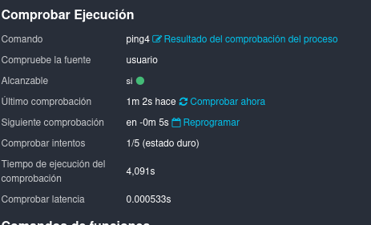


Scrum Icinga

NOMBRE:	Pedro Mª Sánchez Moscoso

`		`Sandra Jiménez Caro

`		`Eduardo Albano Carmona

Curso: 2º ASIR 

# Índice
-----
[**Índice](#_9fb30wxk007a)	**2****

[Historia](#_sz8c47ds6hl5)	2

[Funciones/utilidades y características. Ventajas y desventajas](#_x9rcmsm78z1g)	3
## **Historia**

En mayo de 2009, un grupo de desarrolladores de la comunidad de Nagios anunció **Icinga**, una nueva bifurcación del código, citando su insatisfacción con el estancamiento del desarrollo del software de Nagios en ese momento, y su deseo de abrir su desarrollo a una base más amplia.

En su primer año, los desarrolladores de Icinga lanzaron versiones separadas del núcleo, API e interfaz Web.

En su segundo año, el proyecto Icinga lanzó un núcleo e interfaz web unificados y estables; añadió soporte para la transición de IPv4 a IPv6, optimizó la conectividad de la base de datos y renovó la interfaz de usuario con su "Icinga Web", integró varios complementos de la comunidad (PNP4Nagios, LConf, Heatmap y Business Process Addon). 

El proyecto logró más de 70.000 descargas y la cantidad de miembros del equipo creció a 23. Todavía en su segundo año, integró el componente API de Icinga en la Icinga Web; mejoró el reporte de SLA (Un acuerdo de nivel de servicio ); abrió un grupo oficial de Freenode en IRC y extendió sus dispositivo virtual preconfigurado a los sistemas operativos Debian, OpenSUSE y CentOS.

En octubre de 2012, el proyecto Icinga publicó un avance tecnológico, una rama de reemplazo del núcleo básico, desarrollado en paralelo, **Icinga 2**. Los desarrolladores expresaron sus intenciones de reescribir el núcleo para corregir deficiencias como la complicada configuración y las limitaciones de escalabilidad en grandes despliegues.​ El proyecto señaló planes para escribir el núcleo de Icinga 2 principalmente en lenguaje C++, diseñar una nueva arquitectura de cargador de componentes y remodelar el proceso de ejecución de las verificaciones de ejecución de monitorización.

En junio de 2014, el proyecto Icinga publicó la primera versión estable de Icinga 2.​
## ` `**Funciones/utilidades y características. Ventajas y desventajas**

Algunas de sus funciones y características incluyen:

**Monitoreo de hosts y servicios**: permite monitorear la disponibilidad y el rendimiento de los hosts y servicios en la red. Realizaremos las siguientes pruebas:

- Hacemos un bucle en el sistema.

- Iniciaremos un navegador y abrimos varias pestañas de este.

**Notificaciones:** envía alertas por correo electrónico, mensajes de texto o mediante integraciones con aplicaciones de mensajería instantánea.

**Escalabilidad:** se puede escalar fácilmente para monitorear grandes redes.

Plugins: Icinga incluye una amplia variedad de plugins para realizar diferentes tipos de monitoreo.

**Interfaz web:** proporciona una interfaz web intuitiva para la gestión y el monitoreo de la red.

Ventajas:

- Libre y de código abierto: se puede descargar y utilizar de forma gratuita.
- Flexibilidad: permite una amplia personalización y adaptación a las necesidades específicas de la red.
- Integraciones: se integra fácilmente con otros sistemas y aplicaciones.
- Comunidad activa: cuenta con una comunidad activa que brinda soporte y desarrolla continuamente nuevas funcionalidades.

Desventajas:

- Curva de aprendizaje: puede ser un poco difícil de configurar y utilizar para personas sin experiencia en monitoreo de redes.
- Documentación: la documentación puede ser insuficiente en algunos casos.
- Rendimiento: puede requerir recursos significativos si se monitorea una gran cantidad de hosts y servicios.

## **Plataformas de instalación**

Icinga 2 se puede instalar en los principales sistemas operativos, como Debian, Ubuntu, CentOS, RHEL, FreeBSD, Fedora, ArchLinux y muchos más.

Principalmente, se puede instalar en sistemas operativos Linux.

**Requisitos**

- Un servidor que ejecute Debian 10.
- Una dirección IP estática configurada en tu servidor.
- Una contraseña de root configurada en tu servidor.
- Apache y PHP

**Funciones**

Icinga se encarga de ver el estado de cualquier host y aplicación obteniendo una vista personalizada de lo que más te interese, agrupando y filtrando elementos y combinándolos en paneles. Con la intención de evitar incidentes de infraestructura, te mantiene informado de posibles errores a través de alertas, en el momento y por el canal que prefieras. Además, recopila datos de manera eficiente para la elaboración de informes.

**Precios**

Icinga es un software de monitoreo de código abierto y, por lo tanto, es gratuito de usar. Sin embargo, puede haber costos asociados con el soporte técnico y la implementación profesional.

## **Monitorización**

La monitorización es el proceso de supervisión y registro sistemático de datos y parámetros de un sistema, proceso o entorno con el objetivo de evaluar su rendimiento, detectar posibles problemas y tomar decisiones informadas.

Algunas características de la monitorización incluyen:

- Observación constante o periódica de un sistema o proceso
- Recopilación y análisis de datos y métricas relevantes
- Identificación de posibles problemas y desviaciones en el rendimiento
- Proporcionar información útil para la toma de decisiones

Hay varios tipos de monitorización, incluyendo:

- Monitorización de recursos: supervisión de los recursos de hardware y software, como CPU, memoria, almacenamiento, etc.
- Monitorización de redes: supervisión de la disponibilidad, rendimiento y seguridad de las redes de computadoras.
- Monitorización de aplicaciones: supervisión del rendimiento y disponibilidad de aplicaciones y servicios en línea.
- Monitorización de eventos: supervisión de eventos importantes y notificación en caso de problemas o desviaciones.
- Monitorización ambiental: supervisión de las condiciones ambientales, como temperatura, humedad, etc.

Cada tipo de monitorización utiliza diferentes técnicas y herramientas para recopilar y analizar los datos, y puede ser realizada por software especializado o por un equipo de profesionales de la monitorización.

Configuración:

El token asignado fue dado al final de la instalación

Aplicamos en monitoring

Comprobamos que los módulos php funcionan

Ponemos el tipo de autenticación

Colocamos la configuración de la base de datos previamente configurada

Configuramos la cuenta de administrador

Aplicamos esta configuración por defecto

Nos muestra un resumen de la configuración

Nos da la bienvenida a icinga web 2

## **Diseño de pruebas**
**Prueba de ping:** Comprobaremos si se puede acceder a un host a través de la red y mediremos el tiempo que tarda una respuesta en llegar. Icinga tiene un plugin de ping incorporado, por lo que se puede configurar fácilmente una prueba de ping en Icinga para cada host en la red.

**Prueba de procesos:** Icinga también puede monitorear procesos específicos que se ejecutan en un host. Crearemos una prueba para comprobar si un proceso crítico (ssh), está funcionando correctamente.

**Prueba de espacio en disco**: Esta prueba comprueba la cantidad de espacio disponible en un disco duro y alertará al usuario si el espacio libre cae por debajo de un umbral predefinido. Esto es importante para garantizar que los sistemas no se queden sin espacio de almacenamiento.

**Prueba de uso de CPU:** Esta prueba monitorea el uso de la CPU en un host y alerta si el uso de la CPU alcanza un umbral predefinido.

**Prueba de uso de memoria**: Esta prueba monitorea el uso de la memoria en un host y alerta si el uso de la memoria alcanza un umbral predefinido. Con ello identificaremos problemas de rendimiento y nos aseguraremos de que los sistemas no se queden sin memoria y comiencen a tener problemas de estabilidad.

