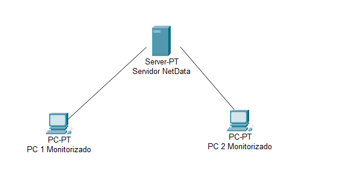

Scrum NetData

NOMBRE:	

Pedro Mª Sánchez Moscoso

Sandra Jiménez Caro

Eduardo Albano Carmona

Curso: 2º ASIR 

## Historia
Netdata es una herramienta de monitoreo en tiempo real y diagnóstico de rendimiento para sistemas y aplicaciones. Fue fundada en 2016 y es de código abierto. Ofrece una visualización en tiempo real de métricas de sistema, como el uso de CPU, memoria, red, entre otros. La herramienta es altamente personalizable y puede ser integrada con una variedad de plataformas y servicios.

Netdata es altamente escalable y se puede utilizar tanto para monitorizar un servidor individual como para monitorizar una infraestructura de múltiples servidores. Además, es compatible con una amplia variedad de sistemas operativos, incluyendo Linux, FreeBSD, macOS y Windows. La herramienta también incluye alertas en tiempo real y una API abierta para facilitar la integración con otras herramientas de monitoreo y gestión. La comunidad de Netdata es muy activa y está en constante desarrollo, lo que garantiza que la herramienta se mantenga actualizada y mejore con el tiempo.

## Funciones/utilidades y características. Ventajas y desventajas

**Funciones y utilidades de Netdata:**

- Monitoreo en tiempo real de métricas de sistema, como el uso de CPU, memoria, red, entre otros.
- Visualización detallada de métricas y estadísticas en una interfaz fácil de usar.
- Alertas en tiempo real para eventos críticos o anomalías en el sistema.
- Integración con una amplia variedad de plataformas y servicios a través de su API abierta.
- Escalabilidad para monitorear un servidor individual o una infraestructura de múltiples servidores.

**Características de Netdata:**

- Código abierto y de acceso libre.
- Compatibilidad con una amplia variedad de sistemas operativos.
- Personalización y extensibilidad a través de plugins y módulos.
- Comunidad activa y en constante desarrollo.
- Interfaz intuitiva y fácil de usar.

**Ventajas de Netdata:**

- Monitoreo en tiempo real y diagnóstico de rendimiento preciso y detallado.
- Integración fácil con otras herramientas de monitoreo y gestión.
- Escalabilidad para una amplia variedad de infraestructuras.
- Comunidad sólida y en constante crecimiento que garantiza un desarrollo continuo.
- Gratuito y de acceso libre.

**Desventajas de Netdata:**

- La configuración inicial puede ser un poco complicada para algunos usuarios menos técnicos.
- La cantidad de información disponible puede ser abrumadora para algunos usuarios.
- La integración con algunas plataformas y servicios puede ser limitada.
- La herramienta puede requerir recursos adicionales en el servidor para su correcto funcionamiento.
- La documentación y el soporte pueden ser limitados en comparación con herramientas de pago.

## Plataformas y requisitos (máquinas a monitorizar).
Netdata sigue una estructura de master-slave. 

Netdata puede monitorizar cualquier sistema operativo que tenga un kernel compatible con la arquitectura del procesador y que pueda ejecutar el agente de Netdata. Esto incluye:

- Linux (Debian, Ubuntu, CentOS, Fedora, Red Hat, openSUSE, etc.)
- macOS
- FreeBSD
- Raspberry Pi OS

Los requisitos mínimos para una máquina a monitorizar son:

- Un sistema operativo compatible.
- Un procesador de 64 bits o 32 bits
- 64 MB de RAM
- Unos pocos MB de espacio en disco
- Acceso a Internet (opcional, pero recomendado para descargar plugins y gráficos)
- Sin embargo, se recomienda tener un sistema con más recursos si se desea monitorear una amplia gama de servicios y aplicaciones.

## Plataformas y requisitos (máquina/s agente/s)

Netdata se puede utilizar en una variedad de sistemas operativos como por ejemplo:

- Linux (Debian, Ubuntu, CentOS, Fedora, Red Hat, openSUSE, etc.)
- macOS
- FreeBSD
- Raspberry Pi OS

Los requisitos mínimos para ejecutar Netdata son:

- Un sistema operativo compatible (ver la lista anterior)
- Un procesador de 64 bits
- 64 MB de RAM
- Unos pocos MB de espacio en disco
- Acceso a Internet (opcional, pero recomendado para descargar plugins y gráficos)
- Se recomienda tener un sistema con más recursos si se desea monitorear una amplia gama de servicios y aplicaciones.

## Instalación NetData (en Debian)

Antes de comenzar con la instalación del programa, vamos a tener que instalar curl.

Para comenzar, en la misma terminal vamos a ejecutar el siguiente comando para descargar y ejecutar el script de instalación:

Una vez terminada la instalación, ya podemos iniciar, habilitar y verificar el estado de Netdata con los siguientes comandos:

De forma predeterminada Netdata escucha en el puerto 19999, y esto se puede confirmar usando en una terminal (Ctrl+Alt+T) el comando netstat como se muestra a continuación:

Si tienes UFW en ejecución, abre el puerto 19999. Será necesario cuando accedas a Netdata desde el navegador. 

Finalmente, para acceder a Netdata abre tu navegador y dirígete a la siguiente URL:

Esquema de Red 

##
## Pruebas netdata
**Verificación de instalación**: Para verificar que Netdata está correctamente instalado en el sistema se ejecuta el comando netdata -v en la línea de comandos. Se puede ver la versión de Netdata instalada en el sistema.

**Prueba de inicio y detención**: Una vez instalado Netdata, ejecutando el comando netdata start se inicia el servicio y netdata stop lo detiene. Verifica que el servicio se inicia y detiene correctamente.

**Monitoreo de recursos del sistema**: Una de las principales funciones de Netdata es el monitoreo de recursos del sistema. Para verificar que Netdata está monitoreando correctamente los recursos del sistema, como CPU, memoria RAM y uso de disco debemos abrir la interfaz de Netdata en un navegador web e identificar la sección de monitoreo de recursos. Realizaremos algunas acciones en el sistema para ver cómo cambian las estadísticas en tiempo real. Estas son:

- Hacer un bucle en el sistema.

Una vez iniciamos el bucle desde nuestra terminal, nos iremos a nuestro netdata y vemos que el uso de RAM está aumentando.

Posteriormente, paramos el bucle y volvemos a ver nuestro netdata.

- Utilizar un navegador como google chrome y abrir varias pestañas.

Abrimos varias pestañas y comprobamos la ram que se ha utilizado. Una vez que se han abierto las pestañas y navegado por internet, se aumenta la ram utilizada.

Al cerrar todas las pestañas que tenemos abiertas, volvemos a comprobar el uso de RAM.

**Monitoreo de red**: Otra función importante de Netdata es el monitoreo de red. Realizaremos una prueba que verificará si Netdata está monitoreando correctamente el tráfico de red. Para ello, utilizaremos una herramienta como iperf para generar tráfico de red el sistema y observar cómo cambian las estadísticas en tiempo real en la interfaz de Netdata.

**Prueba de alertas**: Netdata puede enviar alertas en tiempo real cuando detecta problemas en el sistema, como alta carga de CPU o baja de espacio en disco. Para verificar que las alertas estén funcionando correctamente configuraremos una alerta en Netdata para un umbral de CPU del 80%.

En la siguiente imagen, podemos ver como las alertas las hemos puesto para que lleguen directamente a nuestro correo electrónico, por lo que una vez que salta dicha alerta se manda automáticamente a nuestro correo.

